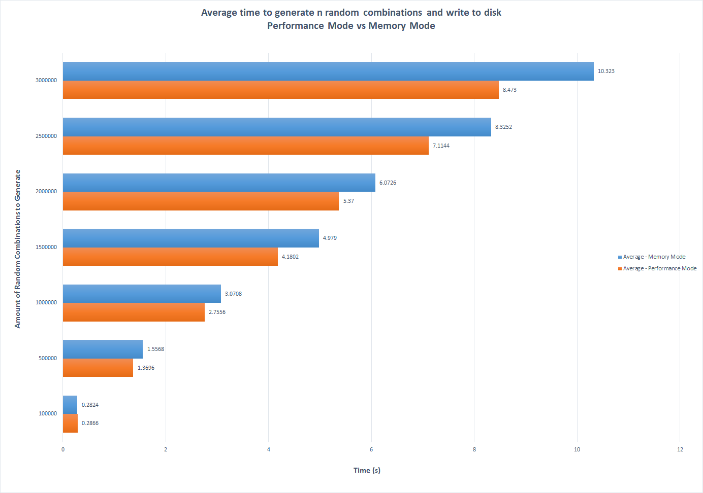

# combigen
An efficient CLI tool to generate possible combinations written in C++

## Introduction
Combigen aims to assist with data generation and exploration. Given a `.json` input where each key contains an array of string values (or simply an array of string arrays), combigen can either generate every possible combination or a random, evenly-distributed subset of the possible combinations. It aims to be memory-efficient while maintaining high-performance. This can be especially useful when large amounts of data are needed for statistical analysis or mock data in an application.

It supports output as `.csv` and `.json`.

## Usage

Basic commands are listed below:


```
Usage: combigen [options]
   -h             Displays this help message

   -a             Generates every possible combination, restricted to memory mode.
                  (Note: this should be used with caution when storing to disk)

   -n <index>     Generate combination at nth index

   -i <input>     Take the given .json file as input. Otherwise, input will come
                  from stdin.
                  Example: "{ "foo": [ "a", "b", "c" ], "bar": [ "1", "2" ] }"

   -t <type>      Output type (csv or json). Defaults to csv

   -r <size>      Generate a random sample of size r from
                  the possible set of combinations

   -d <delimiter> Set the delimiter when displaying combinations (default is ',')

   -k             Display the keys on the first line of output (for .csv)

   -p             Use performance mode to generate combinations faster at the
                  expense of higher RAM usage.
                  (Note: this is only recommended for computers with large amounts
                  of RAM when generating a large number of random combinations)

   -v             Display version number
```

## Prerequisites
### Linux/UNIX/Cygwin
**Required:**
* make
* g++ (capable of compiling to the C++14 standard or higher)

**Optional:**
* [Boost](https://www.boost.org), in case you are working with large sets of data

If you need to install Boost, I recommend utilizing your distro's package manager:

#### Debian/Ubuntu
`$ sudo apt install libboost-all-dev`

#### Fedora
`$ sudo dnf install boost`

#### Arch/Manjaro/Antergos
`$ sudo pacman -Sy boost`


### Windows
**Required:**
* Visual Studio 2015 or higher

**Optional:**
* [Boost](https://www.boost.org), in case you are working with large sets of data. 
I recommend downloaded the precompiled libraries and placing them somewhere easy to remember on your machine.


## Building From Source and Installing
Note: for Windows, if you do not want to/don't have the ability to compile from the source files you can go to the [Release](https://github.com/iamtheburd/combigen/releases) page and directly download the `combigen.exe` binary from there. This also has the added of benefit of being compiled with the Boost libraries already.

### Linux/UNIX

1. Clone the repository and `cd` into it:

```
$ git clone --recurse-submodules -j8 https://github.com/iamtheburd/combigen.git && cd combigen
```

2. Build with `make`:

```
$ make
```

If you need support for larger sets of data (and have Boost installed), instead build with `make perf`:

```
$ make perf
```

3. Install:

```
$ sudo make install
```

### Windows

1. Download Visual Studio 2015+ and install.

2. Clone the repository to some directory using the above command

3. Open up the Developer Command Prompt (can usually be found by searching in the Start menu)

4. `cd` to where your cloned repository is

5. Build the file:

```
> cl /EHsc /O2 src\cli_functions.cpp src\combigen.cpp src\main.cpp /Fe".\combigen.exe" 
```

Alternatively, if you need support for larger sets of data (and have Boost installed somewhere on your machine), run this command instead. Ensure you fill in the proper path to your Boost directory (this example assumes Boost 1.68.0 installed):

```
> cl /EHsc /DUSE_BOOST /O2 /I C:\path\to\boost_1_68_0 src\cli_functions.cpp src\boost_functions.cpp src\main.cpp /Fe".\combigen.exe" /link /LIBPATH:C:\path\to\boost_1_68_0\lib64-msvc-14.1
```

6. Place the resulting `combigen.exe` wherever you desire


## Usage

Using the example `combinations.json` data provided, here are some examples showcasing some features:

### Input

You can either use the `-i` flag and specify an input `.json` file:


```
$ combigen -i example_data/combinations.json -n 100  # Find the combination at index 100
```

Or you can feed in an input from `stdin`:


```
$ cat example_data/combinations.json | combigen -n 100  # Find the combination at index 100
```

Alternatively, if you want to manually type in your string, the program will await user input until EOF. For Windows, this is `CTRL+Z`. For Linux/UNIX, this is `CTRL+D`.

### Output

It's recommended to use your OS's built-in output redirection to write out to a file for ease-of-use and performance:

```
$ combigen -i example_data/combinations.json -r 50000 > output.txt  # Generate 50,000 random combinations
                                                                    # and store them in output.txt
```

### Large Sets of Data

To demonstrate how `combigen` can even work with large sets of data (when compiled with the Boost library) we can use the example `large_bits.json` file. Unlike the above example data, this file only contains an array of string arrays. In this set of data, the maximum size is equivalent to 3 ^ 256. We can still find the last entry (max size - 1):

```
$ combigen -i example_data/large_bits.json -n 139008452377144732764939786789661303114218850808529137991604824430036072629766435941001769154109609521811665540548899435520
2,2,2,2,2,2,2,2,2,2,2,2,2,2,2,2,2,2,2,2,2,2,2,2,2,2,2,2,2,2,2,2,2,2,2,2,2,2,2,2,2,2,2,2,2,2,2,2,2,2,2,2,2,2,2,2,2,2,2,2,2,2,2,2,2,2,2,2,2,2,2,2,2,2,2,2,2,2,2,2,2,2,2,2,2,2,2,2,2,2,2,2,2,2,2,2,2,2,2,2,2,2,2,2,2,2,2,2,2,2,2,2,2,2,2,2,2,2,2,2,2,2,2,2,2,2,2,2,2,2,2,2,2,2,2,2,2,2,2,2,2,2,2,2,2,2,2,2,2,2,2,2,2,2,2,2,2,2,2,2,2,2,2,2,2,2,2,2,2,2,2,2,2,2,2,2,2,2,2,2,2,2,2,2,2,2,2,2,2,2,2,2,2,2,2,2,2,2,2,2,2,2,2,2,2,2,2,2,2,2,2,2,2,2,2,2,2,2,2,2,2,2,2,2,2,2,2,2,2,2,2,2,2,2,2,2,2,2,2,2,2,2,2,2,2,2,2,2,2,2,2,2,2,2,2,2
$
```


### Types

You can export in either `.csv` or `.json`. Use the `-t` flag to explicitly set the output:

#### CSV

If you need the first row to contain column headers, you can also use the `-k` flag to display the keys as column headers:


```
$ combigen -i example_data/combinations.json -r 5 -k  # Generate 5 random combinations and display the keys
Age,First Name,Last Name,Number of Children,Number of Pets,Primary Desktop OS,Primary Mobile Phone OS,Residence,State/Territory
35,Kevin,Long,0,4,macOS,iOS,House,MD
45,Samantha,Thomas,3,1,Linux,Windows,Other,IL
50,Katherine,Williams,4,1,macOS,Windows,Other,TN
60,Kevin,Johnson,5+,1,Windows,Other,Other,NE
90,Sally,Wilson,5+,0,BSD,Windows,RV,PR
$
```

You can also change the delimiter with the `-d` flag:

```
$ combigen -i example_data/combinations.json -r 3 -k -d "||"  # Generate 3 random combinations, display the keys,
                                                              # and set the delimiter to ||
Age||First Name||Last Name||Number of Children||Number of Pets||Primary Desktop OS||Primary Mobile Phone OS||Residence||State/Territory
20||Samantha||Harris||3||4||Windows||Other||RV||GA
25||Matthew||Thomas||2||0||Windows||Other||Town Home||IL
80||James||Jones||1||3||macOS||iOS||House||FM
$                                                               
```

#### JSON

Use the `-t` flag to specify a JSON output:


```
$ combigen -i example_data/combinations.json -r 5 -t json  # Generate 5 random combinations in .json format
[
{
    "Age": "40",
    "First Name": "Matthew",
    "Last Name": "Harris",
    "Number of Children": "5+",
    "Number of Pets": "3",
    "Primary Desktop OS": "Other",
    "Primary Mobile Phone OS": "iOS",
    "Residence": "RV",
    "State/Territory": "UT"
},{
    "Age": "50",
    "First Name": "Kimberly",
    "Last Name": "Anderson",
    "Number of Children": "3",
    "Number of Pets": "3",
    "Primary Desktop OS": "Linux",
    "Primary Mobile Phone OS": "Windows",
    "Residence": "Apartment",
    "State/Territory": "RI"
},{
    "Age": "70",
    "First Name": "Kevin",
    "Last Name": "Torres",
    "Number of Children": "5+",
    "Number of Pets": "0",
    "Primary Desktop OS": "Other",
    "Primary Mobile Phone OS": "iOS",
    "Residence": "Apartment",
    "State/Territory": "LA"
},{
    "Age": "80",
    "First Name": "Sally",
    "Last Name": "Gonzales",
    "Number of Children": "1",
    "Number of Pets": "1",
    "Primary Desktop OS": "BSD",
    "Primary Mobile Phone OS": "Windows",
    "Residence": "Condo",
    "State/Territory": "TN"
},{
    "Age": "90",
    "First Name": "Brooke",
    "Last Name": "Wilson",
    "Number of Children": "1",
    "Number of Pets": "4",
    "Primary Desktop OS": "Other",
    "Primary Mobile Phone OS": "Android",
    "Residence": "House",
    "State/Territory": "CO"
}]
$
```

## Using Performance Mode

When generating a large number of combinations, there come a desire to speed up the process. For this case, use the `-p` flag to set combigen to switch to Performance Mode. This will generate all of the combinations at once before outputting them to `stdout`. **Note: this is only recommended for systems with a large amount of RAM when generating incredibly large sets of data**.

This begins to make a difference when the generated sets of data start to become quite large, as opposed to the default Memory Mode. See the results of some tests below for more information.

For now, when generating every possible combination this will be performed in Memory Mode to save RAM space.

### Performance Tests

To visualize the performance differences between Memory Mode and Performance Mode, a small test was performed to illustrate where Performance Mode begins to offer a significant advantage.

#### Testing Parameters

Each iteration of a test would time the amount of time it takes to generate *n* amount of random combinations and write them to disk; 5 times each. Then, for each amount of *n*, the average of these 5 iterations would be recorded and graphed.

The following tests were performed on a Lenovo ThinkPad T460 with the following specs:

* Windows 7 Enterprise
* 256GB SSD w/full disk encryption
* 8GB Ram
* Intel Core i5 - 6300U @ 2.40GHz

The environment was tested with the following:

* Compiled with Visual Studio Developer Tools 2017 with the compile flags listed above
* Git Bash as a shell to utilize the UNIX `time` function
* Each iteration was generated using the command `time ./combigen.exe -i example_data/combinations.json -r "$n" # amount of random combinations > output.txt`

The source code for these shell scripts can be found in the [peformance_tests](performance_tests/) folder.

#### Testing Results

The results from the test were graphed:



#### Conclusion

Based on the results above, Performance Mode will only start to offer real benefits when the amount of combinations is quite large. However, this should only be used when the computer can truly handle storing all of these combinations in RAM. Ultimately, it boils down to two factors:

* If you can spare time and don't want to bog down your machine (or the amount of generated combinations is small), stick with the default Memory Mode
* If you have a well-spec'd machine and can sacrifice the RAM when generating a large amount of combinations, choose Performance Mode.

Regardless, a large amount of combinations requires a large amount of disk space, so keep this into account when generating data.

## Third-Party Libraries

Combigen uses the following open-source libraries:

* [nlohmann/json](https://github.com/nlohmann/json) - An excellent C++ library for parsing JSON

* [lazy-cartesian-product](https://github.com/iamtheburd/lazy-cartesian-product) - Small C++ library I developed to generate the combinations

* [skandhurkat/Getopt-for-Visual-Studio](https://github.com/skandhurkat/Getopt-for-Visual-Studio) - Port of the MinGW version of `getopt.h` so that the CLI works on Windows

* [Boost](https://www.boost.org) - For operating with incredibly large sets of data that push the limits of an `unsigned long long`.


## Contributing
Pull-requests are always welcome

## License
Licensed under GPLv3, see [LICENSE](https://github.com/iamtheburd/combigen/blob/master/LICENSE)
